# Aufstand oder Aussterben  (Und: Kann ich etwas tun?) {data-background=#F7EE6A }

# Warum bist du heute hier? {data-background="#bed276"}

#  {data-background=#ed9bc4 .without-heading}

Extinction Rebellion (XR) ist eine gewaltlose Bewegung für direkte Aktion und zivilen Ungehorsam.  Wir drängen Regierungen, Firmen und Gesellschaft zum Handeln gegen Klimakatastrophe und ökologischen Zusammenbruch.

# Dieser Vortrag wird Gefühle auslösen:{data-background=#75d0f1 .small-heading}

Schock Verleugnung Kummer Apathie Wut Erleichterung

# Gerechtigkeit für alle: {data-background=#14aa37 .small-heading}

Klimagerechtigkeit – Wirtschaftliche Gerechtigkeit – Umweltgerechtigkeit

Macht

Rassengerechtigkeit – Soziale Gerechtigkeit – Gendergerechtigkeit

# Worum geht es in diesem Talk? {data-background=#ffc11e  .small-heading}

- Teil 1: Die Klima- und Umweltkrise
- Teil 2: Was wir tun müssen

#  Worum geht es in diesem Talk? {data-background=#ffc11e  .small-heading}

- Teil 1: Die Klima- und Umweltkrise

# Das Erdsystem erhält uns {data-background="pics/erde-schwarzer-hintergrund.png" .white-heading}

# Wir sind dabei es zu zerstören {data-background=#000000 .white-small-heading}

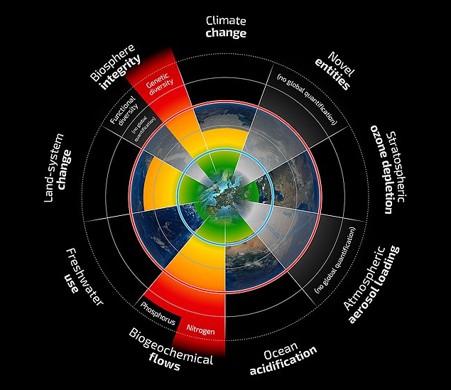

#

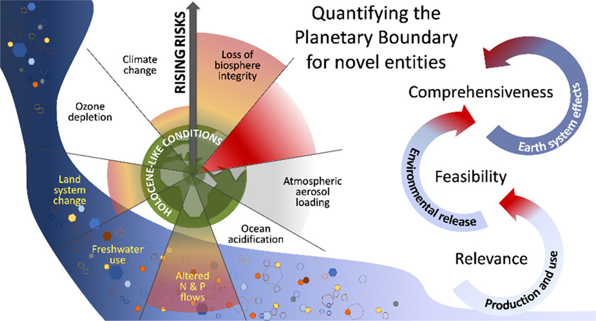

# Was ist mit dem Klima los? {data-background="#3860aa" .white-heading}

# Treibhausgase erwärmen die Erde {data-background=#000000 .white-small-heading}

# Fossile Brennstoffe entscheiden {.small-heading data-background=#ed9bc4}

<iframe scrolling="no" frameborder="0" marginheight="0px" marginwidth="0px" style="display: initial; margin: 0 auto;" src="https://cbhighcharts2021.s3.eu-west-2.amazonaws.com/climate-justice/cumulative-emissions/land-use-fossil-emissions.html" width="770px" height="550px"></iframe>

::: notes

Annual global CO2 emissions from fossil fuels and cement (dark grey) as well as from land use, land-use change and forestry (green), 1850-2021, billions of tonnes. Source: Carbon Brief analysis of figures from the Global Carbon Project, CDIAC, Our World in Data, Carbon Monitor, Houghton and Nassikas (2017) and Hansis et al (2015). Chart by Carbon Brief using Highcharts.

[Analysis: Which countries are historically responsible for climate change? - Carbon Brief](https://www.carbonbrief.org/analysis-which-countries-are-historically-responsible-for-climate-change "Analysis: Which countries are historically responsible for climate change? - Carbon Brief")

:::

# CO2 treibt die Temperaturen nach oben {data-background="pics/co2-temperaturen.png"  .small-heading}

# Die Erhitzung folgt den Prognosen exakt {data-background=#ed9bc4 .small-heading}

![Veränderungen der globalen Oberflächentemperatur im Vergleich zu 1850-1900. (a) Veränderung der globalen Oberflächentemperatur (Zehnjahresdurchschnitt) wie rekonstruiert (1-2000) und beobachtet (1850-2020); (b) Veränderung der globalen Oberflächentemperatur (Jahresdurchschnitt) wie beobachtet und simuliert unter Verwendung menschlicher und natürlicher Faktoren (hellbraun) und nur natürlicher Faktoren (grünlich) (beide 1850-2020). (Bildnachweis: Abbildung SPM.1 aus AR6 WGI Summary of Policymakers, IPCC)](pics/ipcc-ar6-surface-temperatures.png)

# Wir haben kein CO2-Budget mehr {.small-heading data-background=#75d0f1}

<iframe width="560" height="315" src="https://www.youtube.com/embed/6zP0L69ielU" title="YouTube video player" frameborder="0" allow="accelerometer; autoplay; clipboard-write; encrypted-media; gyroscope; picture-in-picture" allowfullscreen></iframe>

# Nichthandeln beschleunigt die Katastrophe {.small-heading data-background=#f7ee6a}

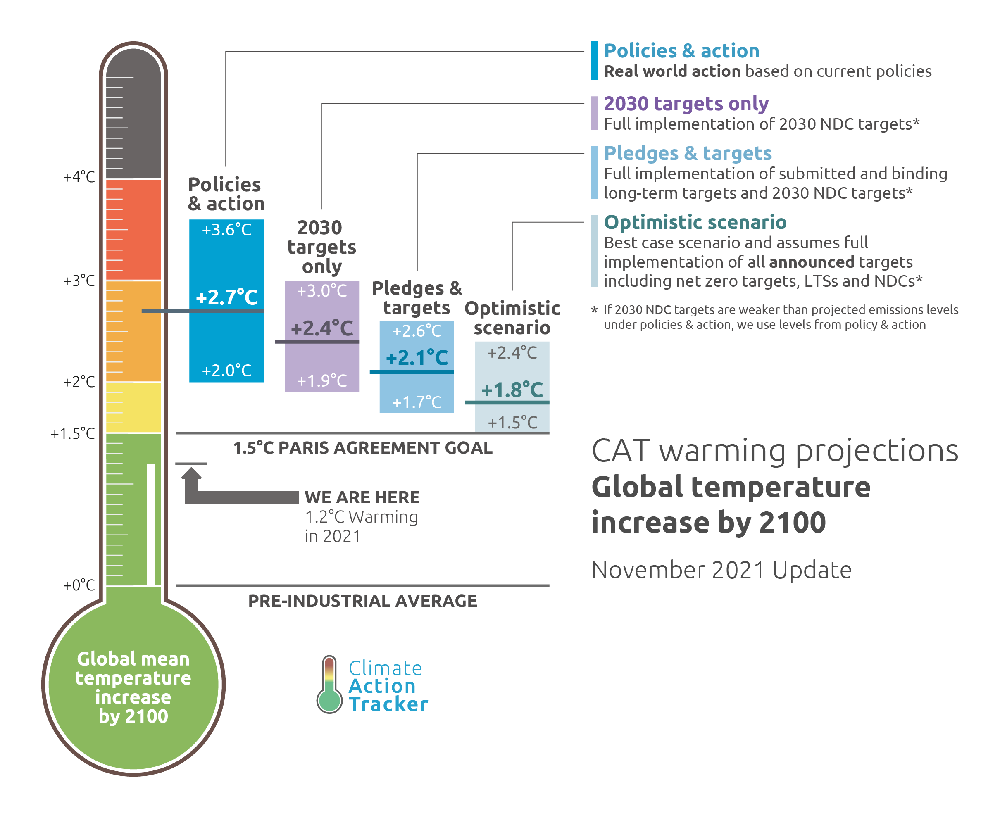{width="70%"}

# { .without-heading data-background=#c80082}

"Today’s IPCC Working Group 1 report is a code red for humanity.  The alarm bells are deafening, and the evidence is irrefutable:  greenhouse‑gas emissions from fossil-fuel burning and deforestation are choking our planet and putting billions of people at immediate risk.  Global heating is affecting every region on Earth, with many of the changes becoming irreversible. ([António Guterres](https://www.un.org/press/en/2021/sgsm20847.doc.htm "Secretary-General Calls Latest IPCC Climate Report ‘Code Red for Humanity’, Stressing ‘Irrefutable’ Evidence of Human Influence | Meetings Coverage and Press Releases"))

# Rückkopplungen können die Erhitzung verstärken

- Weniger Reflexion durch Eis
- Methananreicherung durch Auftauen von Permafrost

# Potentielle Kaskaden von Tipping Points { .small-heading }

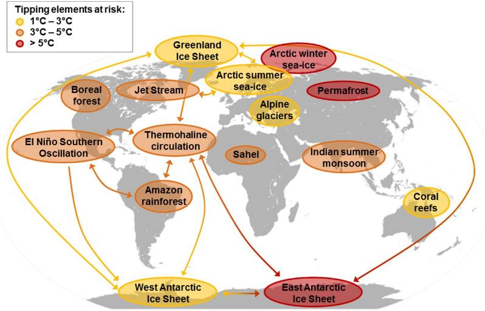

# Risiko Hothouse-Earth { .small-heading }

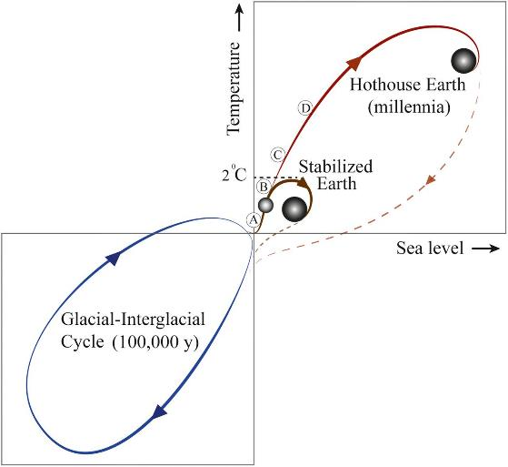

# Das war nur ein Teil des Problems {data-background="pics/xr-symbole-gruen-hintergrund.png" .white-heading}

# Wir zerstören das ganze Erdsystem

# Die Erde hat Land- und Meeres-Ökosysteme. Wir zerstören beide. {data-background="pics/land-meer-oekosysteme-hintergrund.png" .white-small-heading}

# {data-background=#000000 .without-heading}

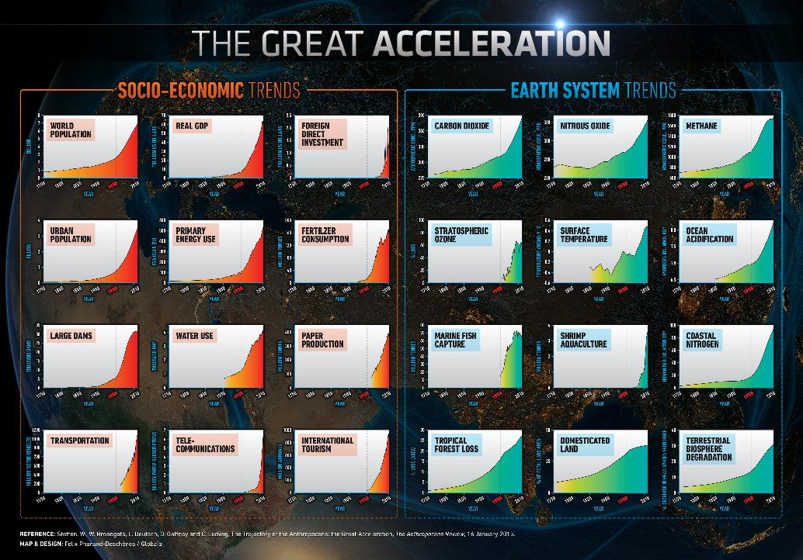

# Intensiv-Landwirtschaft hat die Wildnis verdrängt { data-background="pics/intensiv-landwirtschaft-hintergrund.jpg" .white-small-heading }

#    Entwaldung reduziert CO2-Abbau, Biodiversität und Feuchtigkeitsregulierung { data-background="pics/entwaldung-hintergrund.jpg" .white-small-heading }

# Diese Prozesse führen zu Versteppung und Wüstenbildung { data-background="pics/wuestenbildung-hintergrund.jpg" .white-small-heading }

#      Die Ozeane sind eine CO2-Senke und ernähren viele Menschen. Unser Überleben hängt von ihnen ab. { data-background="pics/ozeane-hintergrund.jpg" .white-small-heading }

# Die Erwärmung der Meere reduziert gelöstes O2, erhöht den Säuregehalt, tötet Ökosysteme, ändert Strömungen und zerstört Eiskappen. { data-background="pics/ozeane-hintergrund.jpg" .small-heading }

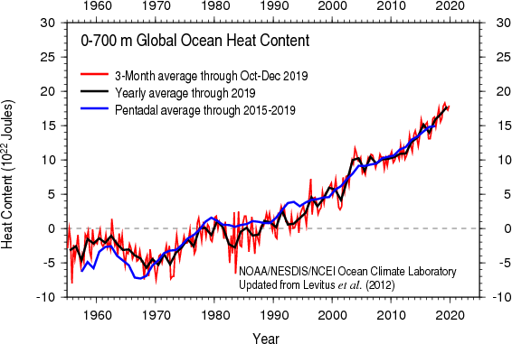

# Das sechste Massenaussterben hat begonnen {.small-heading}

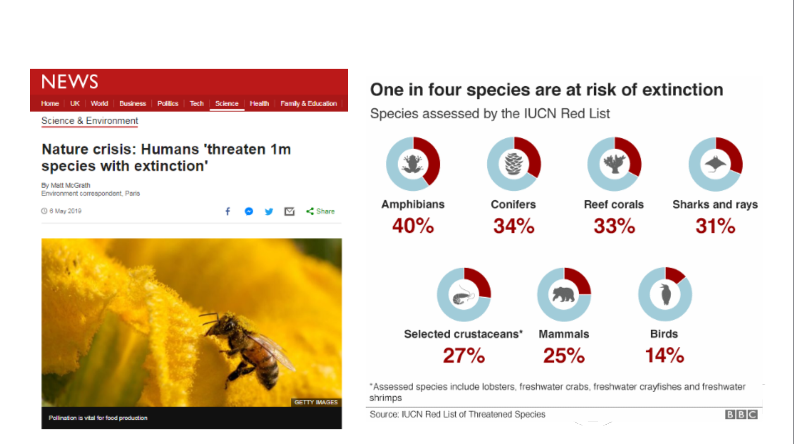{ width="90%" }

# Wilde Biomasse (Fleisch) verschwindet { .small-heading }

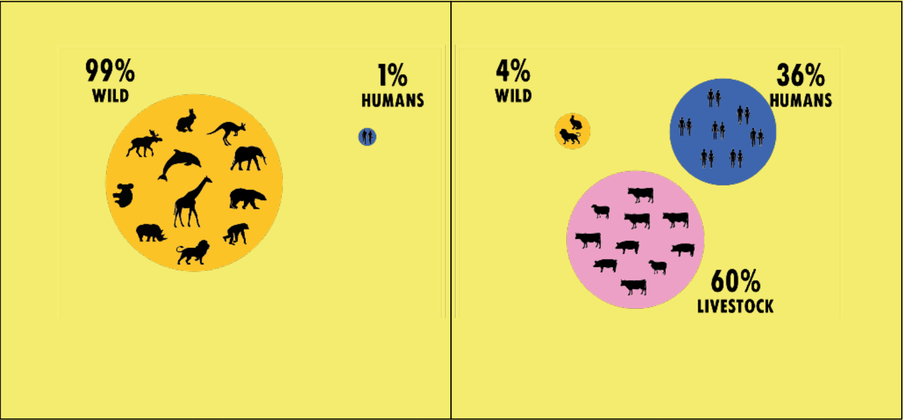{ width="100%" }

Vor 10.000 Jahren vs. heute

# { data-background="pics/biodiversity-loss-map-andy-purvis-news.jpg" .without-heading }

::: notes

Karte: [Biodiversity loss breaching safe limits worldwide | Natural History Museum](https://www.nhm.ac.uk/discover/news/2016/july/biodiversity-breaching-safe-limits-worldwide.html "Biodiversity loss breaching safe limits worldwide | Natural History Museum")

Auf der Grundlage von [Has land use pushed terrestrial biodiversity beyond the planetary boundary? A global assessment](https://www.science.org/doi/10.1126/science.aaf2201 "Has land use pushed terrestrial biodiversity beyond the planetary boundary? A global assessment")

:::

# Unsere Kinder werden den Reichtum, den wir geerbt haben, vielleicht nie kennenlernen. { data-background=#14aa37 .small-heading }

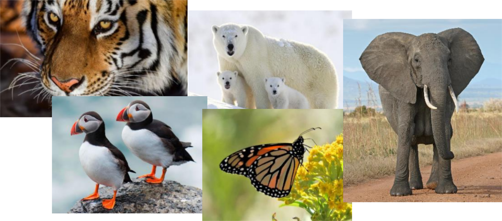

# Wir gefährden auch die unscheinbaren Arten  { data-background=#ed9bc4 .small-heading }

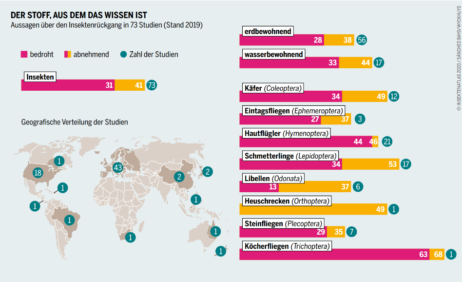{ width="90%" }

# Und wenn wir die Grundlage unserer Ernährung zerstören, zerstören wir unsere Zukunft { data-background=#f7ee6a .small-heading }

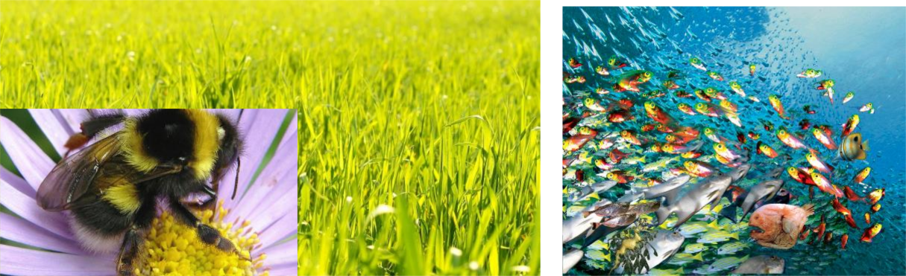

# Wir haben nur wenige Jahre Zeit! {.small-heading}

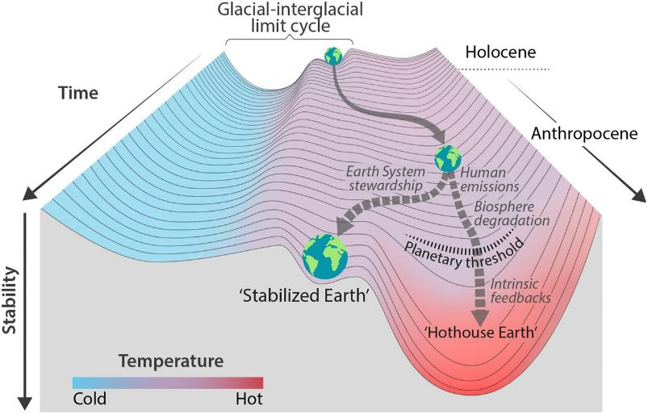

<!--

# Warming Stripes

Ed Hawkins

# Code red for huma

# Etwas mehr Wärme macht einen großen Unterschied

# Das Klimachaos ist nur das halbe Problem

# +2° hatten wir nur vor 130.000 Jahren

 ... und +4°C vor Jahrmillionen

#

# Die Erhitzung verändert das globale Wetter

# Die Erhitzung zerstört Gesellschaften

# Folgen der Klimakrise in Österreich 2018

- Tieflagen Ober- und Niederösterreichs bis zu 2,6°C wärmer als 1981-2010
- 16.4. mehr als 112 mm/m2 Regen in Graz
- Extreme Dürren im Norden
- Bis zu 40% weniger Ertrag in der Landwirtschaft
- Waldzerstörung durch Borkenkäfer
- Wegen Niedrigwasser 1.003 Gigawattstunden weniger beim Verbund im Juli/August

# Was, wenn wir die Erde weiter aufheizen?

# Folgen von Business as Usual

- Meeresspiegel-Anstieg durch Eisschmelze und thermische Ausdehnung, Überschwemmungen und Sturmfluten
- Mehr Extremwetter mit SWtürmen, Dürren, Waldbränden, Wüstenbildung und Ernteausfällen
- Todesfälle durch Hitzestress
- Hungersnöte, Wassermangel, Erzwungene Migration
- Krieg

# Drohendes Massenaussterben

# Zu unseren Lebzeiten

# Zeit zum Nachdenken

# Nichts hat gewirkt

# COP26 war ein Fiasko

#

- 1,5° am Leben halten ist eine Lüge
- Aktuelle Ziele führen hierhin
- Aktuelle Politik fürt hierhin

#

# ist keine Option

#

# Der persönliche CO2-Fußabdruck ist Greenwashing

# Individuelles Handeln ist falsche Hoffnung

# Was hat uns hierher gebracht?

- Wahlen führten zu kurzfristigem Handeln
- Wachstum über allem
- Lobbyismus für Privatinteressen

#

#

#

# Wir sind Extinction Rebellion!

-->
