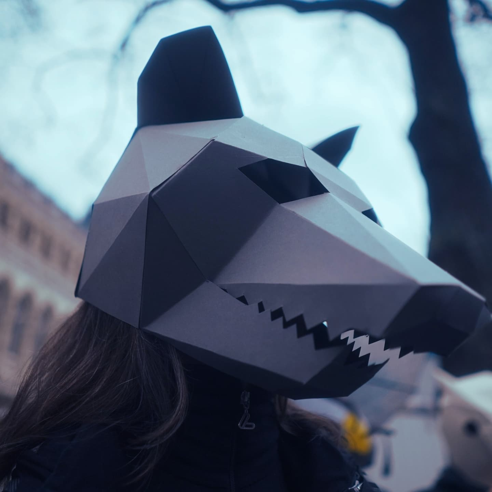
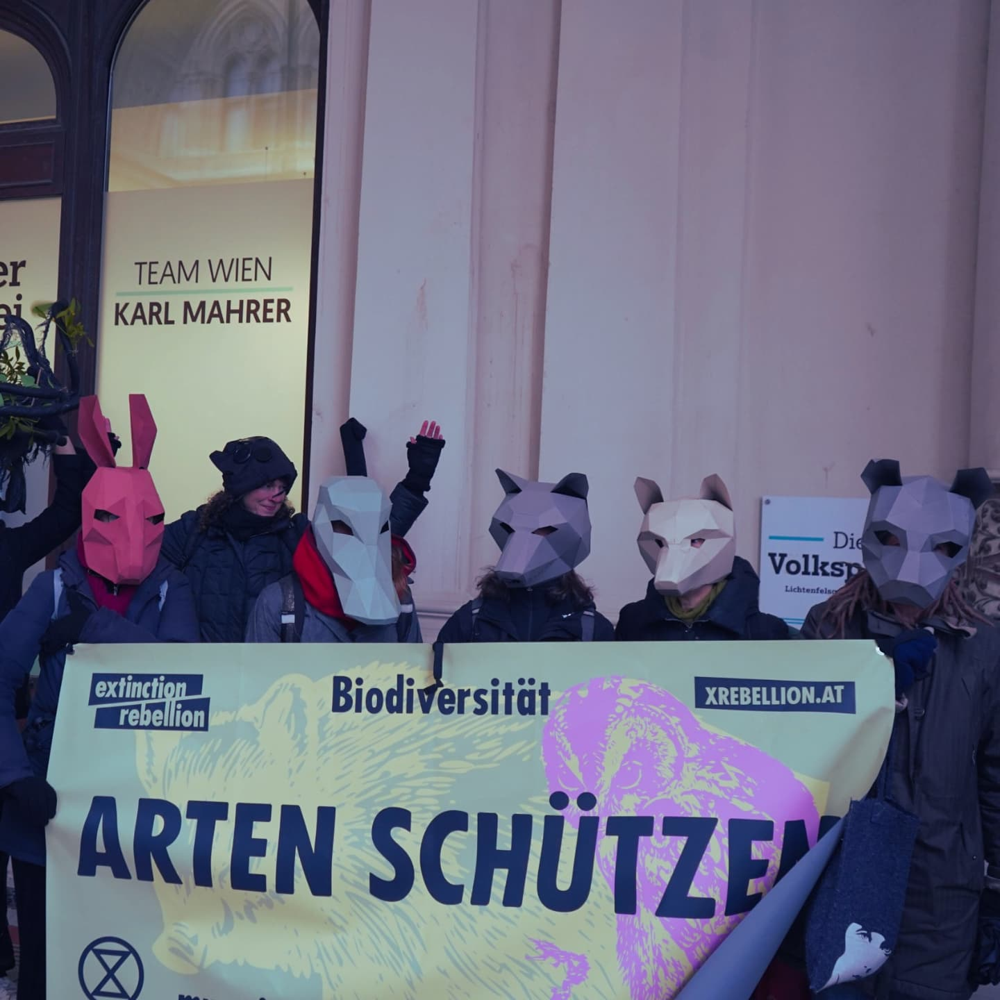
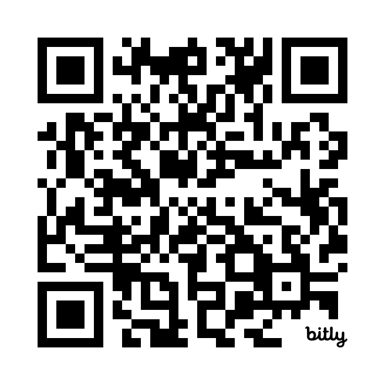

# Wann wenn nicht wir?  {data-background=#F7EE6A }

# Wer sind wir? {data-background=#ed9bc4 .small-heading}

Extinction Rebellion (XR) ist eine gewaltlose Bewegung für direkte Aktion und zivilen Ungehorsam. Wir drängen Regierungen, Firmen und Gesellschaft zum Handeln gegen Klimakatastrophe und ökologischen Zusammenbruch.

Unsere Prinzipien und Werte: <https://xrebellion.at/ueber-uns/prinzipien-werte/>

# Was tun wir? {data-background=#75d0f1 .small-heading}

* Wir führen unangemeldete und angemeldete öffentliche Aktionen für Klimagerechtigkeit und Schutz der Biodiversität durch.
* Wir pflegen eine regenerative Kultur.
* Wir arbeiten mit anderen sozialen Bewegungen zusammen.

# {data-background=#F7EE6A }

# Wo findet man uns? :{data-background=#ffc11e .small-heading}

* In Wien: Bei regelmäßigen XR-Cafés und Treffen
* Auf unserer Website <https://xrebellion.at/>
* Auf Instagram: <https://www.instagram.com/extinctionrebellionaustria/>
* Bei Telegram: <https://t.me/XRAustria>

# {data-background=#F7EE6A}

